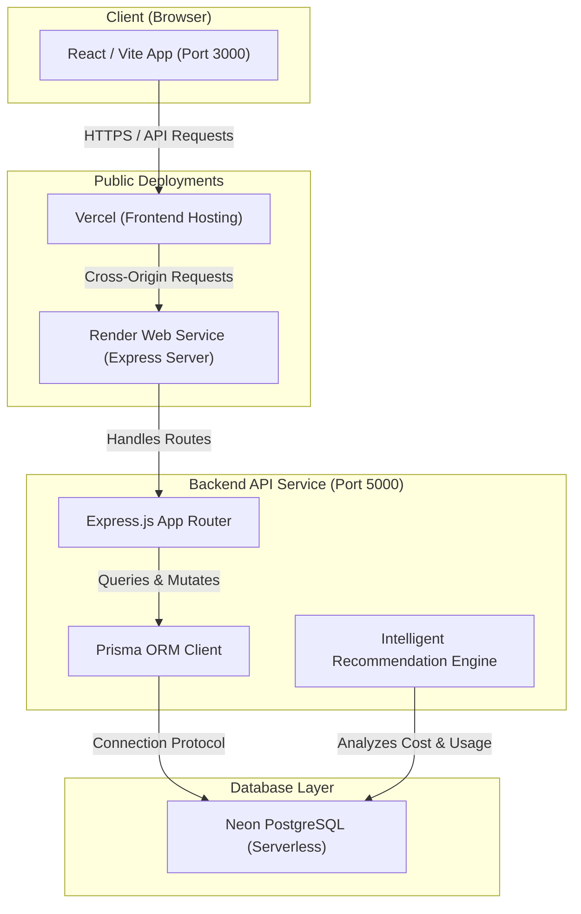
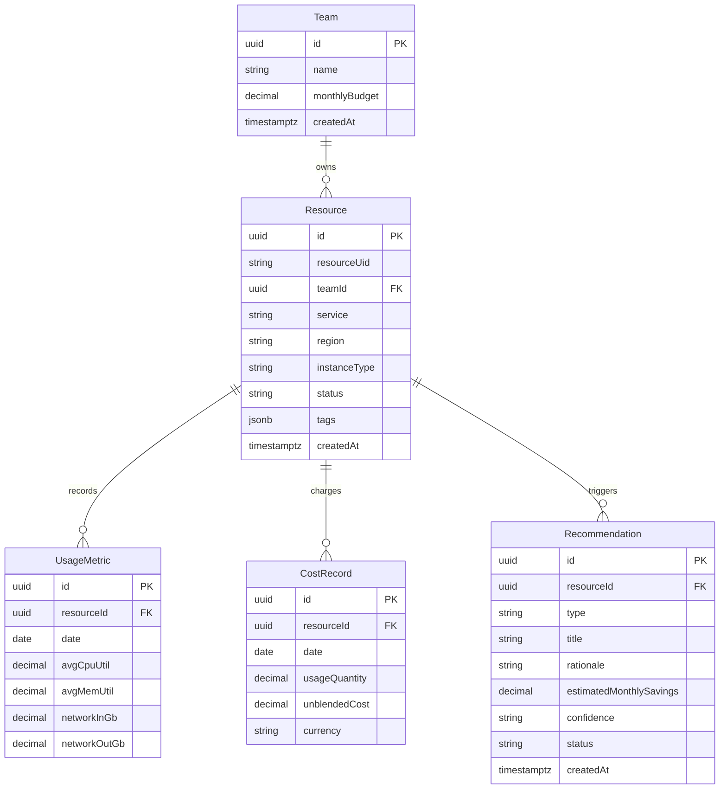

# CloudLens — Cloud Cost Optimization Platform

CloudLens is a premium, full-stack cloud cost optimization platform designed to help organizations monitor cloud spending, identify resource waste, and automatically generate intelligent cost-saving recommendations. The application enables teams to gain visibility into their infrastructure, manage budgets, track resource efficiency, and safely apply remediation.

---

## 🚀 Live Demonstration

*   **Frontend Deployment (Vercel)**: [https://cloud-lens-web.vercel.app/](https://cloud-lens-web.vercel.app/)
*   **Backend API Deployment (Render)**: [https://cloudlens-3.onrender.com/](https://cloudlens-3.onrender.com/)
*   **Backend Liveness Endpoint**: [https://cloudlens-3.onrender.com/api/health](https://cloudlens-3.onrender.com/api/health)

---

## 🛠️ Technology Stack

*   **Frontend**: React (v18), Vite, TypeScript, TailwindCSS, Lucide React (Icons), Recharts (Interactive Analytics charts).
*   **Backend**: Node.js, Express, TypeScript, Nodemon, Vitest (Unit testing).
*   **Database & ORM**: PostgreSQL (Hosted on Neon serverless database), Prisma ORM client.
*   **Deployments**: Vercel (Frontend), Render (Backend API).

---

## 📂 Project Folder Structure

The project is structured as a monorepo using npm workspaces:

```text
├── apps/
│   ├── api/                 # Node.js/Express Backend
│   │   ├── dist/            # Compiled JavaScript output
│   │   ├── scripts/         # Seeding and database utility scripts (seed.ts)
│   │   ├── src/             # Application source files
│   │   │   ├── middleware/  # Custom middleware (CORS, Error Handlers)
│   │   │   ├── prisma/      # Prisma DB Schema definition (schema.prisma)
│   │   │   ├── routes/      # Express API routers (costs, resources, teams, recommendations)
│   │   │   ├── services/    # Recommendation Engine logic
│   │   │   └── index.ts     # Main Server Entrypoint
│   │   └── tsconfig.json    # Backend TS compiler config
│   │
│   └── web/                 # React Frontend
│       ├── dist/            # Production static site assets
│       ├── src/             # React application source code
│       │   ├── components/  # Layouts and reusable UI elements
│       │   ├── lib/         # API connection libraries
│       │   └── main.tsx     # React Entrypoint
│       ├── tailwind.config.js # Tailwind CSS design system configuration
│       └── vite.config.ts   # Vite bundler and proxy configuration
│
├── package.json             # Monorepo root workspaces script definitions
└── package-lock.json        # Unified monorepo lockfile
```

---

## 🏗️ High-Level Architecture & Solution Design

### Components & Data Flow



### Design Decisions & Trade-offs
*   **Serverless Neon PostgreSQL DB**: Chosen for low-latency queries and autoscaling capabilities. It provides structured schemas which are critical for cost/resource metrics consistency.
*   **Prisma ORM**: Provides static type-safety, which matches the TypeScript codebase. Using Prisma's transaction operations avoids race conditions when generating multiple recommendations concurrently.
*   **Vite Dev Server Proxying**: Local development routes `/api/*` requests through a Vite proxy, resolving local CORS configurations. For production, CORS is globally enabled via standard middleware on Render.
*   **Frontend Performance**: Used `@tanstack/react-query` to cache endpoint responses, prevent redundant requests on route switches, and provide smooth state updates.

---

## 🗄️ Database Design

The data layer models resources, cost records, daily usage metrics, teams, and cost-saving recommendations.

### Entity-Relationship Diagram



---

## 📊 Evaluation Test Data

The database comes fully populated with mock telemetry data spanning **90 days** of infrastructure logs. Running the seeding script seeds the following:

*   **Teams**: 5 distinct business teams (*Platform*, *Growth*, *Data*, *Mobile*, *Security*).
*   **Cloud Resources**: 50 cloud assets (such as *EC2 Instances*, *RDS Databases*, *EBS Volumes*, *S3 Buckets*, *Lambda Functions*, *ElasticIPs*).
*   **Cost Records**: 2,503 records tracking daily spending.
*   **Usage Telemetry**: 2,503 usage records tracking CPU%, memory, and network throughput.
*   **Recommendations**: 34 open cost-saving opportunities auto-generated by analyzing the seeded usage telemetry (e.g. flagging instances with $<5\%$ CPU utilization as `idle` or flagging 90+ day old backups as `stale`).

---

## 🔌 API Documentation

### 1. Teams
*   `GET /api/teams`: Retrieves all teams.
*   `GET /api/teams/leaderboard`: Computes efficiency scores and ranks teams by waste ratio.
*   `POST /api/teams`: Creates a new team.
    *   *Body*: `{ "name": "DevOps", "monthlyBudget": 15000 }`
*   `GET /api/teams/:id`: Fetches a team.
*   `PATCH /api/teams/:id`: Updates a team's properties.
*   `DELETE /api/teams/:id`: Deletes a team.

### 2. Resources
*   `GET /api/resources?search=&team=&limit=100`: Returns filtered resources.
*   `GET /api/resources/:id`: Fetches details of a specific resource.
*   `GET /api/resources/:id/usage`: Fetches the telemetry usage history for that resource.
*   `POST /api/resources`: Creates a resource.
    *   *Body*: `{ "resourceUid": "i-abc123xyz", "service": "EC2", "region": "us-east-1", "status": "running" }`
*   `PATCH /api/resources/:id`: Updates resource settings or tags.
*   `DELETE /api/resources/:id`: Deletes a resource.

### 3. Recommendations
*   `GET /api/recommendations?status=open&limit=100`: Returns recommendations.
*   `GET /api/recommendations/summary`: Aggregates active savings and recommendation count.
*   `POST /api/recommendations/:id/apply`: Applies the recommendation. Automatically updates the status to `applied` and executes mock remediation (e.g., changes status of a related resource to `terminated` or `deleted`).
*   `POST /api/recommendations/:id/dismiss`: Dismisses/archives the recommendation.
*   `POST /api/recommendations/:id/reopen`: Restores a recommendation to `open` status.

### 4. Cost Data
*   `GET /api/costs/summary?range=30d&groupBy=service`: Aggregates total cost grouped by *service*, *team*, or *region*.
*   `GET /api/costs/trend?range=90d&interval=weekly`: Fetches chronological points for spend over time.

---

## 💻 Local Setup & Installation

### Prerequisites
*   Node.js (v18+)
*   npm (v9+)
*   A running PostgreSQL database instance (or a serverless PostgreSQL service like Neon).

### Step 1: Install Dependencies
From the repository root, install dependencies for all workspaces:
```bash
npm install
```

### Step 2: Configure Environment Variables
Create a `.env` file in the backend folder:
*   File: `apps/api/.env`
```env
PORT=5000
DATABASE_URL=your_postgresql_connection_string
NODE_ENV=development
```

Create a `.env` file in the frontend folder:
*   File: `apps/web/.env`
```env
VITE_API_BASE_URL=http://localhost:5000
```

### Step 3: Run Database Migrations & Seed Data
Initialize the database schemas and generate the Prisma Client, then populate it with test data:
```bash
# Generate Prisma Client
npm run db:generate

# Apply migrations
npm run db:migrate

# Run database seeding script
npm run seed
```

### Step 4: Run Application
Start the development servers for both frontend and backend:
```bash
npm run dev
```
*   **Web Frontend**: [http://localhost:3000/](http://localhost:3000/)
*   **Backend API**: [http://localhost:5000/](http://localhost:5000/)

---

## ☁️ Deployment Instructions

### 1. Deployed Backend (Render)
*   **Service Type**: Web Service (Node.js runtime).
*   **Root Directory**: `apps/api`
*   **Build Command**: `npm install && npm run db:generate && npm run build`
*   **Start Command**: `node dist/src/index.js`
*   **Environment Variables**:
    *   `DATABASE_URL`: Your production connection string.
    *   `NODE_ENV`: `production`

### 2. Deployed Frontend (Vercel)
*   **Root Directory**: `apps/web`
*   **Framework Preset**: Vite
*   **Build Command**: `npm run build`
*   **Output Directory**: `dist`
*   **Environment Variables**:
    *   `VITE_API_BASE_URL`: Your live Render API URL (e.g. `https://cloudlens-3.onrender.com`)

---

## 🔮 Future Enhancements & Limitations

### Current Assumptions & Limitations
1.  **Read-Only Metrics**: Cost metrics and CPU telemetry data are simulated by the seed generator to mock real-world AWS logs. Real-world applications require polling integration with AWS CloudWatch/CUR.
2.  **No Auth**: Currently accessible to all users for evaluator ease. Future stages require JWT Auth.

### Roadmap
*   **API Integrations**: Pull direct logs from AWS Cost Explorer and Google Cloud Billing APIs.
*   **Autoremediation Scheduler**: Schedule auto-terminations of idle dev databases during weekends.
*   **Multi-Currency Support**: Add local conversions (EUR, GBP, INR) for global teams.

---

## 👥 Authors
*   **Aafiya**
*   **Kuresh**
